# RAG Application — Step 2: Knowledge Base

## Data Source

System design interview prep articles scraped from [hellointerview.com](https://www.hellointerview.com/learn/system-design).  
26 articles covering core concepts, key technologies (Redis, Kafka, PostgreSQL, etc.), and advanced topics (vector databases, etc.).  
Each article is stored as a markdown file with YAML frontmatter (`url`, `title`, `free`, `scraped_at`) under `kb/raw/`.

---

## Chunking Strategy

Two-stage split using LangChain:

1. **Section split** — `MarkdownHeaderTextSplitter` splits each article on H1/H2/H3 headers. Each section carries `section_title` and `section_path` metadata.
2. **Chunk split** — `RecursiveCharacterTextSplitter` (tiktoken `cl100k_base`, 700 tokens, 120 overlap) splits each section into token-sized chunks. All non-empty chunks are kept.

Result: **1,108 chunks** across 1,084 sections from 26 documents.  
Sections ≈ chunks because most sections are short enough to fit within the 700-token limit — each section produces exactly one chunk. Only ~24 sections are long enough to split further. This is expected for a well-structured study KB.

```mermaid
%%{ init: { 'theme': 'base' } }%%
flowchart TD
    classDef file      fill:#dbeafe,stroke:#3b82f6,color:#1e3a5f
    classDef process   fill:#dcfce7,stroke:#16a34a,color:#14532d
    classDef artifact  fill:#ede9fe,stroke:#7c3aed,color:#2e1065
    classDef splitter  fill:#fef9c3,stroke:#ca8a04,color:#713f12
    classDef embed     fill:#fee2e2,stroke:#dc2626,color:#7f1d1d
    classDef user      fill:#bfdbfe,stroke:#2563eb,color:#1e3a5f
    classDef retrieval fill:#fef3c7,stroke:#d97706,color:#78350f
    classDef llm       fill:#fce7f3,stroke:#db2777,color:#831843
    classDef metric    fill:#ecfdf5,stroke:#059669,color:#064e3b

    subgraph INGEST["🏗️  INGEST + EMBED — runs once"]
        direction LR
        MD["📄 kb/raw/*.md<br/>YAML frontmatter + body"]:::file
        P["② preprocess_kb.py<br/>extract title · normalize text"]:::process
        S["③ MarkdownHeaderTextSplitter<br/>split on H1/H2/H3<br/>→ section_title metadata"]:::splitter
        C["④ RecursiveCharacterTextSplitter<br/>700 tok · 120 overlap<br/>cl100k_base tokenizer"]:::splitter
        E["⑤ embed.py · mxbai-embed-large-v1<br/>prefix: Title > Section: text<br/>→ 1024-dim · L2-normalize"]:::embed

        MD -->|"① scrape"| P --> S --> C --> E
    end

    IDX[("💾 kb/index.faiss<br/>1108 × 1024 vectors")]:::artifact
    META[("💾 kb/index_meta.json<br/>chunk text + metadata")]:::artifact

    E -->|"index.add()"| IDX
    C -->|"save chunks"| META

    subgraph QUERY["💬  QUERY PIPELINE — per user request"]
        direction LR
        USR(["👤 User · Streamlit UI"]):::user
        QE["② Query Encoder<br/>search prefix + mxbai-embed-large-v1<br/>→ 1024-dim · L2-normalize"]:::embed
        VS["③ Dense Retrieval<br/>IndexFlatIP.search(q, k)<br/>→ top-k indices + scores"]:::retrieval
        CTX["④ Context Builder<br/>fetch chunk text + title by index"]:::retrieval
        LLM["⑤ GPT-4o<br/>answer ONLY from context<br/>stream: True"]:::llm
        ANS["⑥ Streamlit renders<br/>answer token-by-token"]:::user

        USR -->|"① types question"| QE
        QE -->|"query vector"| VS
        VS -->|"top-k indices"| CTX
        CTX -->|"context string"| LLM
        LLM -->|"stream tokens"| ANS
    end

    VS -->|"lookup"| IDX
    CTX -->|"lookup"| META

    subgraph EVAL["🧪  EVAL PIPELINE — offline quality measurement"]
        direction LR
        TESTS["📋 tests.jsonl · 23 questions<br/>categories: direct_fact · temporal<br/>comparative · numerical<br/>relationship · spanning · holistic"]:::file
        RETRIEVE["rag.retrieve(question, k=5)<br/>→ top-k chunks"]:::retrieval
        RMETRICS["Retrieval Metrics<br/>MRR — mean reciprocal rank of keyword hits<br/>NDCG — rank-weighted relevance score<br/>keyword coverage — % keywords in top-k"]:::metric
        ROUT["💾 last_run_retrieval.json"]:::artifact
        GEN["rag.generate_answer(model=gpt-4o)<br/>stream=False · full response"]:::llm
        JUDGE["GPT-4o judge<br/>AnswerEval via Pydantic structured output<br/>prompt: question + generated + reference"]:::llm
        AMETRICS["Answer Metrics  (1–5 each)<br/>accuracy — factual correctness<br/>completeness — all aspects covered<br/>relevance — directness to question"]:::metric
        AOUT["💾 last_run_answer.json"]:::artifact

        TESTS -->|"per question"| RETRIEVE
        RETRIEVE --> RMETRICS --> ROUT
        RETRIEVE -->|"top-k chunks"| GEN
        GEN --> JUDGE --> AMETRICS --> AOUT
    end

    RETRIEVE -->|"lookup"| IDX
    RETRIEVE -->|"lookup"| META

    subgraph LEGEND["Legend"]
        direction LR
        L1["📄 Raw file / input"]:::file
        L2["⚙️ Processing step"]:::process
        L3["✂️ Text splitting"]:::splitter
        L4["🔢 Embedding / encoding"]:::embed
        L5["🔍 Dense retrieval"]:::retrieval
        L6["🤖 LLM call"]:::llm
        L7["📊 Evaluation metric"]:::metric
        L8["👤 User / UI"]:::user
        L9[("💾 Persistent storage")]:::artifact
    end
```

---

## Embedding Model

- **Model**: `mixedbread-ai/mxbai-embed-large-v1` (Hugging Face, via `sentence-transformers`)
- **Dimensions**: 1024
- **Contextual prefix**: each chunk is prepended with `Title > Section: ` before embedding, grounding it semantically in its document context
- **Query prefix**: `Represent this sentence for searching relevant passages: {query}`
- **Normalization**: L2-normalized so cosine similarity = inner product

---

## FAISS Indexing

- **Index type**: `IndexFlatIP` — exact inner-product search (= cosine similarity after L2 normalization)
- **Pipeline**: `chunks.jsonl` → encode → cast to `float32` → L2-normalize → `index.add()`
- **Files**: `kb/index.faiss` (vectors), `kb/index_meta.json` (full chunk metadata list, indexed by position)
- **Why `IndexFlatIP` and not HNSW**: at 1,108 chunks, brute-force O(n) search is instant. HNSW is appropriate for 100k+ vectors; using it here would be premature complexity with no practical benefit.

---

## Semantic Retrieval Validation

Retrieval quality is measured via `evaluation/eval.py` against 23 hand-written test questions across 7 categories (`direct_fact`, `temporal`, `comparative`, `numerical`, `relationship`, `spanning`, `holistic`).

Metrics per question:
- **MRR** — rank of first chunk containing an expected keyword
- **NDCG** — rank-weighted keyword coverage
- **Keyword coverage** — % of expected keywords found in top-k chunks

The LLM is instructed to answer **only from retrieved context** (`"Answer based ONLY on the provided context"`), and to explicitly refuse if the answer is not present — reducing hallucination to near zero for out-of-KB queries.

Edge cases handled: empty query (text input guard), no relevant results (system prompt instructs refusal), API errors (caught and displayed in UI).

---

## Reflection

**What worked well:**
- Contextual chunking prefix (`Title > Section: text`) measurably improves retrieval by grounding short chunks in their document context
- `IndexFlatIP` with L2-normalized embeddings gives exact cosine similarity with zero approximation error — correct for this KB size
- LLM-as-judge evaluation (GPT-4o scoring accuracy/completeness/relevance) gives interpretable quality signal beyond keyword matching

**What could be improved:**
- Trafilatura converts HTML tables and code blocks to `##` headers — affects 6% of chunks (67/1,108), mostly in `zookeeper.md` and `postgresql.md`. Switching to `markdownify` would fix this.
- 120-token average chunk size is small; merging very short sections into neighbors before chunking would reduce noise in the index.
